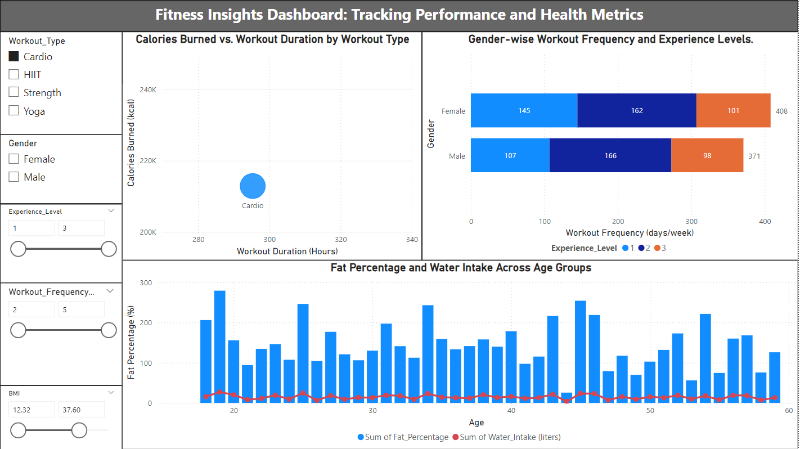
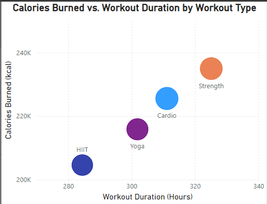
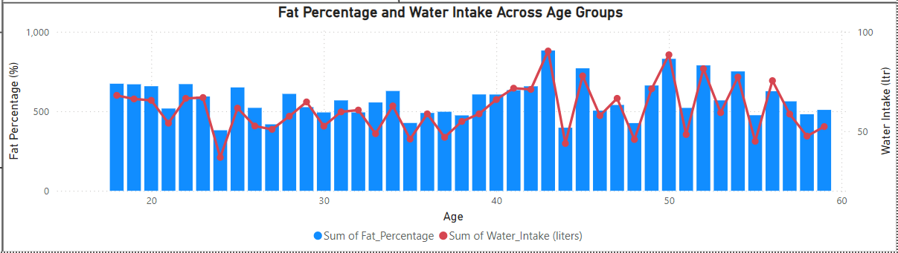

# Fitness-Insight-Dashboard

This Power BI dashboard provides detailed insights into workout performance, health metrics, and trends across demographics. It enables fitness enthusiasts and professionals to make data-driven decisions to enhance health and performance.

## Dashboard Overview

## Dynamic Slicers

## Features
- **Calories Burned vs. Workout Duration By Workout Type:**  
  A scatter plot showing the relationship between calories burned and workout duration by workout type.  
  

- **Gender-wise Workout Frequency and Experience Levels:**  
  A bar chart comparing workout frequency across genders and experience levels.  
  

- **Fat Percentage and Water Intake Across Age Groups:**  
  A line chart visualizing the correlation between fat percentage and water intake across different age groups.  
  

## Tools Used
- **Power BI:** For creating an interactive and dynamic dashboard.
- **Data Processing:** Cleaned and transformed data to ensure accuracy in analysis.

## Key Insights
- Strength workouts burn the most calories with longer durations, while HIIT maximizes calorie burn in shorter sessions.
- Workout frequency and experience levels differ significantly across genders.
- Higher water intake correlates with improved fat percentage management in most age groups.
